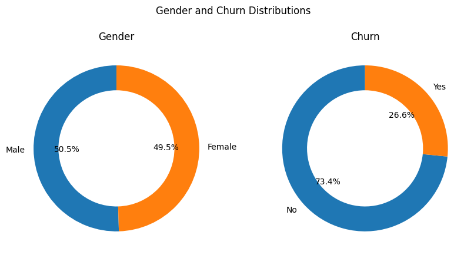
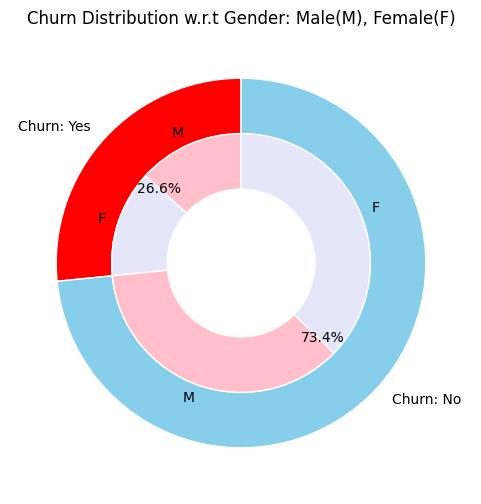
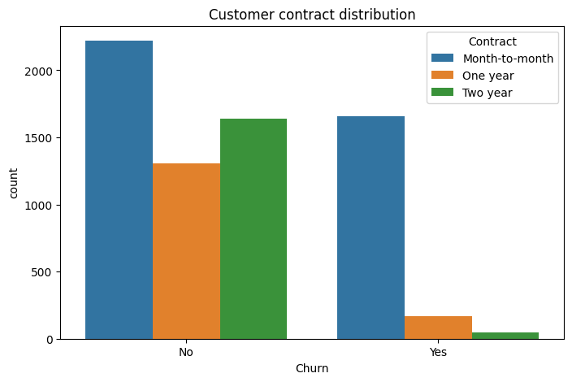
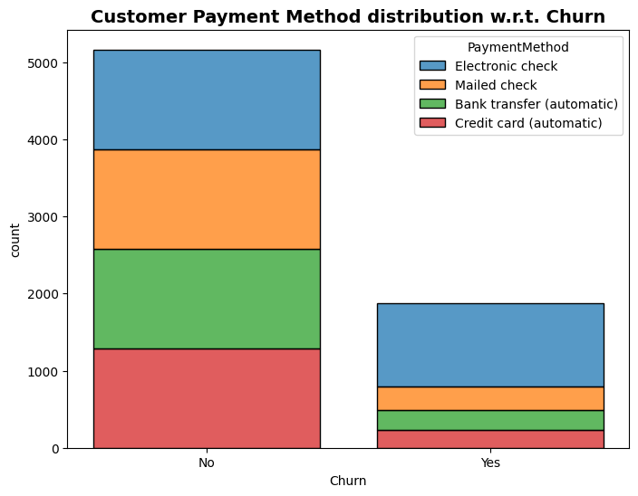

# 📊 Customer Churn – Graph Report

## 1. Gender and Churn Distributions

**Insight:**  
- Gender Distribution is nearly perfect balance with 50.5% male and 49.5% female customers, indicating no gender bias in the dataset.
- While in Churn Rate, 26.6% of customers churned while 73.4% remained, showing that roughly 1 in 4 customers left the service. This is a significant churn rate that warrants attention.

## 2. Churn Distribution w.r.t Gender

**Insights:**
- Churn rate is identical across genders (26.6% for both male and female customers), indicating gender is not a predictive factor for churn.

## 3. Customer Contract Distribution

**Insights:**
- Month-to-month customers have dramatically higher churn rates compared to annual contract holders.

## 4. Customer Payment Method Distribution

**Insights:**
- Electronic check users show higher churn rates compared to other payment methods. Customers using automatic payment methods (bank transfer and credit card) have much better retention.