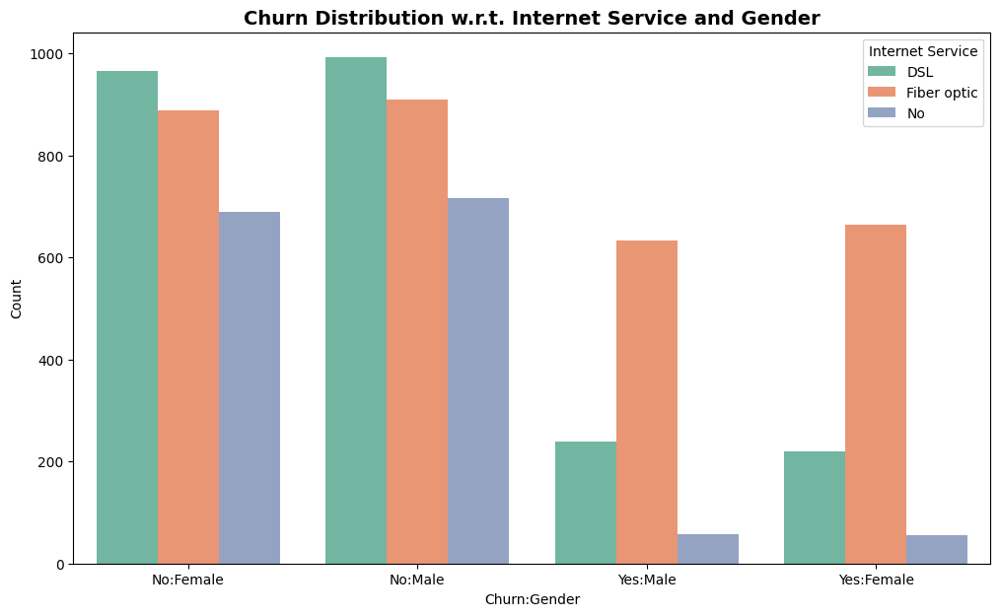
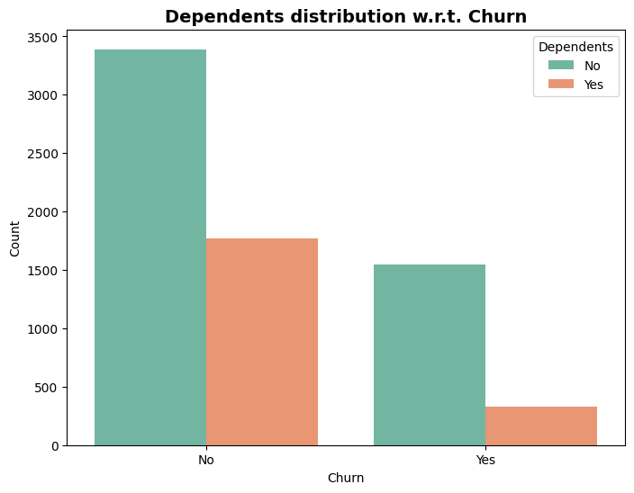
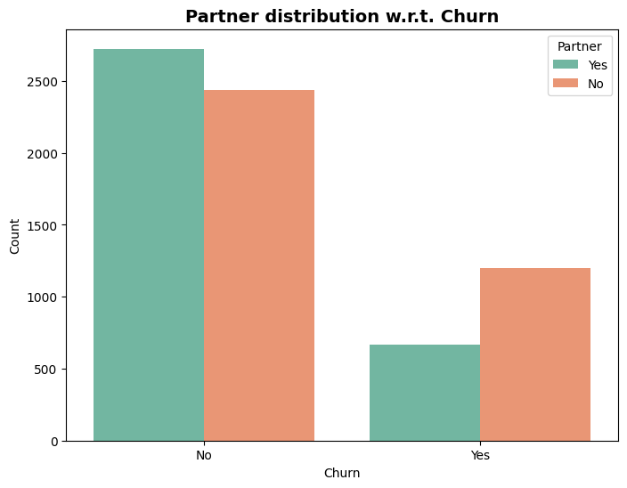
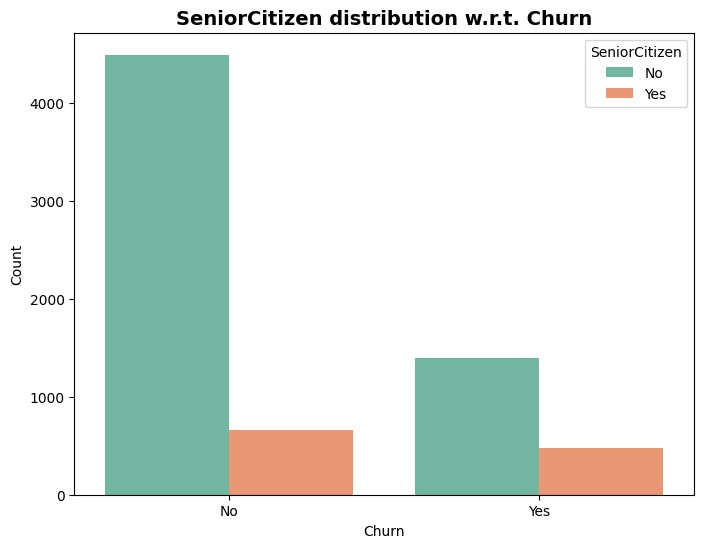
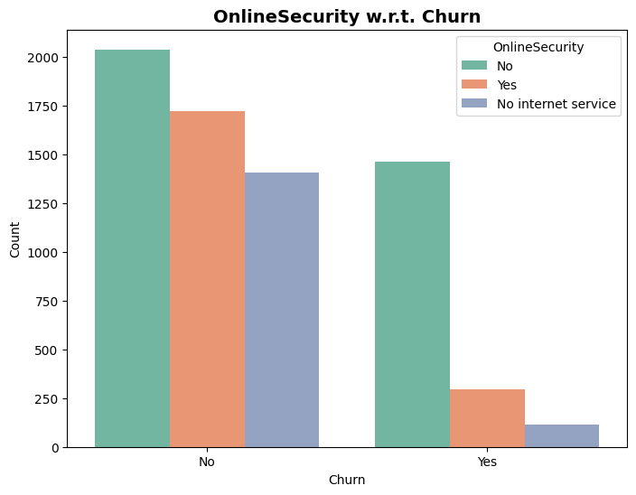
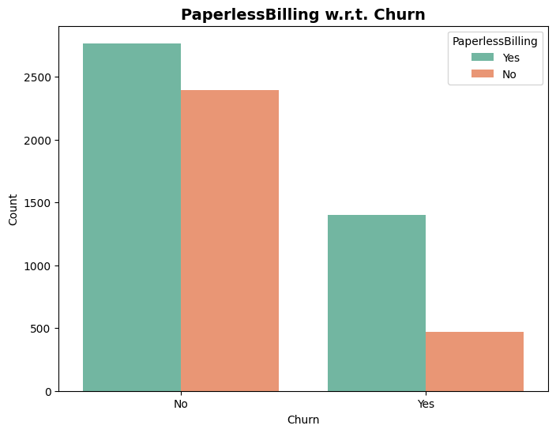
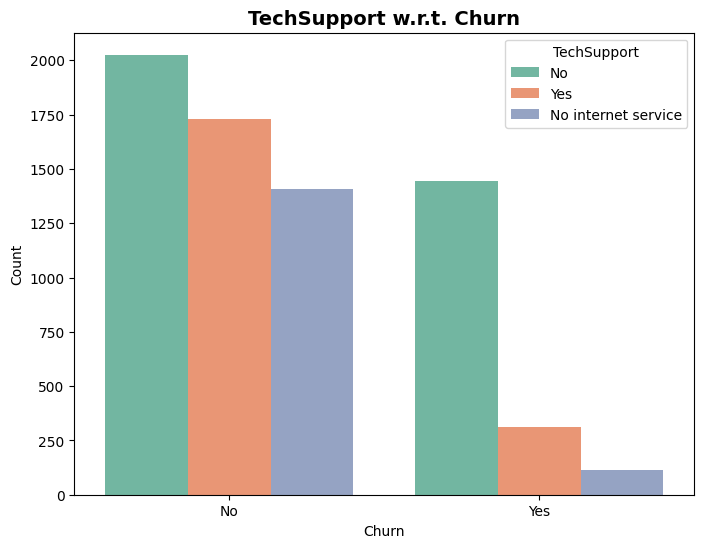
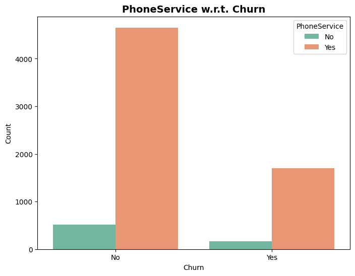
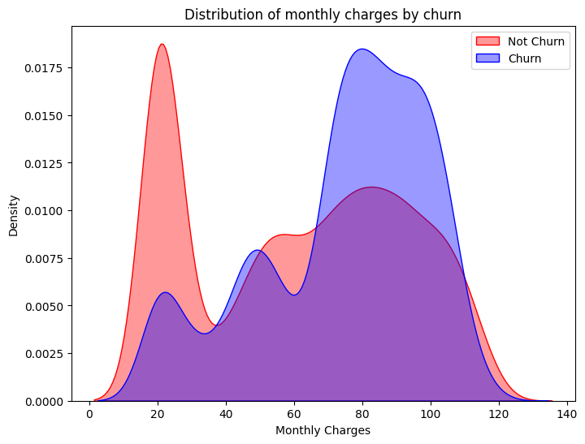

# 📊 Customer Churn – Graph Report

## 1. Gender and Churn Distributions

**Insight:**  
- Gender Distribution is nearly perfect balance with 50.5% male and 49.5% female customers, indicating no gender bias in the dataset.
- While in Churn Rate, 26.6% of customers churned while 73.4% remained, showing that roughly 1 in 4 customers left the service. This is a significant churn rate that warrants attention.

## 2. Churn Distribution w.r.t Gender

**Insights:**
- Churn rate is identical across genders (26.6% for both male and female customers), indicating gender is not a predictive factor for churn.

## 3. Customer Contract Distribution

**Insights:**
- Month-to-month customers have dramatically higher churn rates compared to annual contract holders.

## 4. Customer Payment Method Distribution

**Insights:**
- Electronic check users show higher churn rates compared to other payment methods. Customers using automatic payment methods (bank transfer and credit card) have much better retention.

## 5. Internat Service and Gender Distribution

**Insights:**
- Fiber optic customers show the highest churn rates across both genders, while customers without internet service have the lowest churn. DSL customers fall in between.

## 6. Dependents Distribution

**Insights:**
- Customers without dependents have significantly higher churn rates than those with dependents. Having family dependents appears to create stronger customer loyalty.

## 7. Partner Distribution

**Insights:**
- Customers without partners show higher churn rates than those with partners. Similar to the dependents pattern, having a partner appears to increase customer retention.

## 8. SeniorCitizen Distribution

**Insights:**
- Non-senior citizens have significantly higher churn rates than senior citizens. Senior customers demonstrate much stronger loyalty and retention.

## 9. Online Security Distribution

**Insights:**
- Customers without online security services show higher churn rates than those with the service.

## 10. PaperlessBilling Distribution

**Insights:**
- Customers using paperless billing have significantly lower churn rates than those receiving paper bills. Digital engagement through paperless billing appears to correlate with higher customer retention.

## 11. TechSupport Distribution

**Insights:**
- Customers without tech support services have higher churn rates than those with the service. Similar to online security.

## 12. PhoneService Distribution

**Insights:**
- Most customers have phone service, and those with phone service show lower churn rates than the small segment without it.

## 13. Monthly Charges Distribution

**Insights:**
- Retained customers cluster around lower monthly charges (~$20-30), while churned customers are heavily concentrated in higher charge ranges ($70-110). This clearly indicates that pricing is a major churn driver, with customers paying higher monthly fees being significantly more likely to leave.